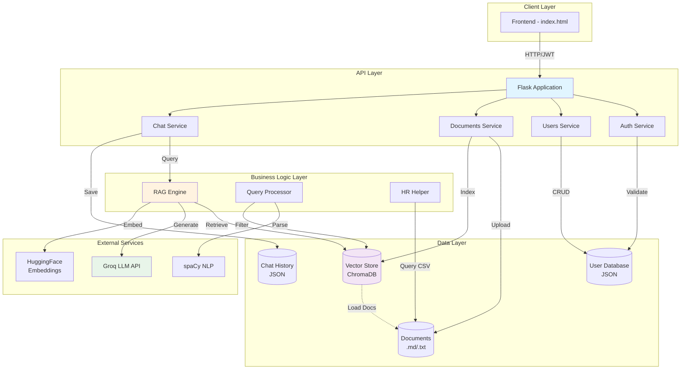
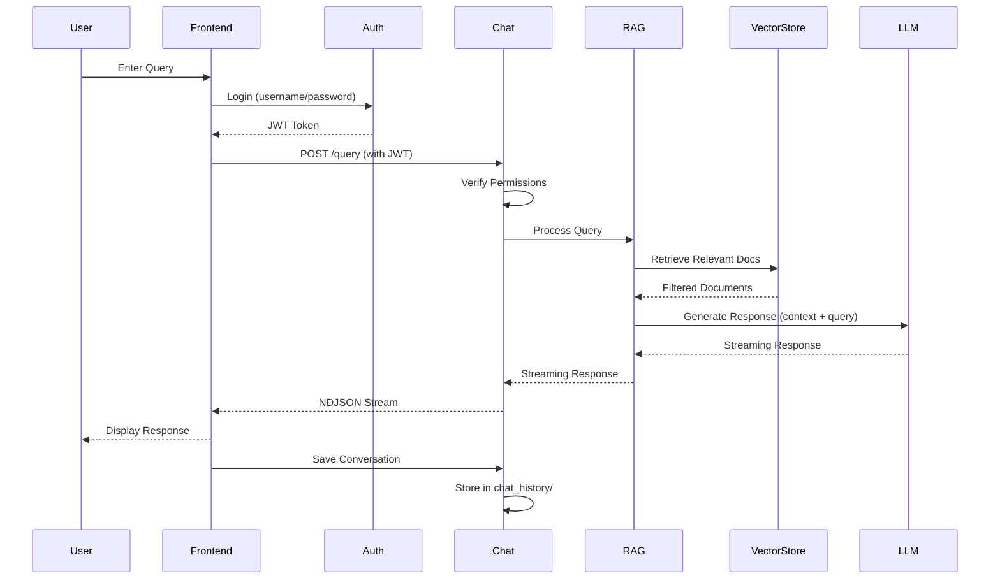

# FinSolve RAG Assistant — Role-based RAG chatbot for department-specific insights

A Retrieval-Augmented Generation (RAG) prototype implementing Role-Based Access Control (RBAC) to deliver secure, role-specific insights to Finance, Marketing, HR, Engineering, C-Level, and Employees. Built with langchain ,chroma, Groq llm, flask.
## project structure

```
DS-RPC-01/
├── app/
│   ├── __init__.py              # flask app factory
│   ├── main.py                  # application entry point
│   ├── schemas/
│   │   └── __init__.py          # data validation schemas
│   ├── services/
│   │   ├── auth.py              # authentication & jwt
│   │   ├── users.py             # user management
│   │   ├── documents.py         # document upload
│   │   └── chat.py              # chat & conversations
│   └── utils/
│       ├── rag_engine.py        # vector store & rag logic
│       ├── query_processor.py   # spacy query processing
│       └── hr_helper.py         # hr data queries
├── resources/
│   ├── data/                    # department documents
│   ├── database/                # user data & chat history
│   └── static/                  # frontend files
├── pyproject.toml               # package configuration
├── requirements.txt             # dependencies
└── README.md                    # this file
```

## features

- **role-based access control**: manager, finance, hr, engineering, marketing roles
- **department-specific retrieval**: users only access permitted documents
- **conversational rag**: chat history context with streaming responses
- **document upload**: managers can add new documents to knowledge base
- **user management**: managers can create new users
- **chat history**: persistent conversation storage per user

## installation

1. install python dependencies:

```bash
pip install -r requirements.txt
```

2. download spacy model:

```bash
python -m spacy download en_core_web_sm
```

3. create `.env` file with your groq api key:

```bash
GROQ_API_KEY=your_api_key_here
```

## running the application

### development mode

```bash
python app/main.py
```

the application will run on `http://localhost:5000`

### production mode

```bash
gunicorn -w 4 -b 0.0.0.0:5000 "app:create_app()"
```

## api endpoints

### authentication

- `POST /auth/login` - user login, returns jwt token

### conversations

- `GET /conversations` - list all conversations
- `GET /conversations/<id>` - get specific conversation
- `POST /conversations` - create new conversation
- `DELETE /conversations/<id>` - delete conversation
- `POST /conversations/<id>/save` - save conversation

### chat

- `POST /query` - send query and get streaming rag response
- `GET /permissions` - get current user permissions

### users

- `GET /users` - get demo users list
- `POST /users/add` - add new user (manager only)
- `GET /users/permissions` - get role permissions

### documents

- `POST /documents/upload` - upload document (manager only)

## default users

| username | password | role |
|----------|----------|------|
| manager | manager123 | manager |
| fin_user | finance123 | finance |
| hr_user | hr123 | hr |
| eng_user | eng123 | engineering |
| mkt_user | marketing123 | marketing |

## department access

- **manager**: all departments
- **finance**: finance, general
- **hr**: hr, general
- **engineering**: engineering, general
- **marketing**: marketing, general

## development notes

- vector store is automatically initialized on first run
- chat memories are stored in-memory (cleared on restart)
- conversations are persisted to json files
- documents must be .md or .txt format
- streaming responses use ndjson format

## technology stack

- **backend**: flask 3.0
- **ai/ml**: langchain, groq llm, huggingface embeddings
- **vector store**: chromadb
- **nlp**: spacy
- **frontend**: vanilla javascript with marked.js

## architecture

the application follows a modular blueprint-based architecture:

1. **app factory pattern**: creates and configures flask app
2. **blueprints**: separate concerns (auth, users, docs, chat)
3. **services layer**: business logic and api endpoints
4. **utils layer**: reusable components (rag, query processing, hr)
5. **schemas**: data validation and serialization

### architecture diagram



### data flow



## troubleshooting

**vector store not found**
- the app will create it automatically from documents in resources/data/

**spacy model error**
- run: `python -m spacy download en_core_web_sm`

**groq api errors**
- check your GROQ_API_KEY in .env file
- ensure you have api credits

**import errors**
- make sure you're running from project root
- check all dependencies are installed

## license

proprietary - internal use only
